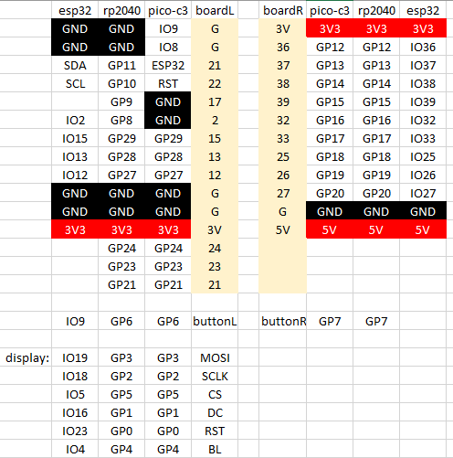

# TTGO T-Display ESP32 board

It is supported by Circuitpython since 2023. Get the latest image here: [https://circuitpython.org/board/lilygo_ttgo_tdisplay_esp32_16m/](https://circuitpython.org/board/lilygo_ttgo_tdisplay_esp32_16m/)

It includes an online installer!

## MADCTL

This value from the init sequence to the ST7789V display driver for the 240x135 display changes direction of refresh and some color adjustments. Different boards have these values implemented differently. Here an overview:

| board                                                                                                                                           | MADCTL | _MADCTL    | rotation | column start | row start | width | height |
|-------------------------------------------------------------------------------------------------------------------------------------------------|--------|------------|----------|--------------|-----------|-------|--------|
| [T-Display rp2040](https://github.com/adafruit/circuitpython/blob/main/ports/raspberrypi/boards/lilygo_t_display_rp2040/board.c)                | 0x08   | 0b00001000 |       90 |           53 |        40 |   240 |    135 |
| [T-Display ESP32 16M](https://github.com/adafruit/circuitpython/blob/main/ports/espressif/boards/lilygo_ttgo_tdisplay_esp32_16m/board.c)        | 0x08   | 0b00001000 |      270 |           53 |        40 |   240 |    135 |
| [Feather ESP32-S2 with TFT](https://github.com/adafruit/circuitpython/blob/main/ports/espressif/boards/adafruit_feather_esp32s2_tft/board.c)    | 0x68   | 0b01101000 |        0 |           40 |        53 |   240 |    135 |
| [Feather ESP32-S2 reverse TFT](https://github.com/adafruit/circuitpython/tree/main/ports/espressif/boards/adafruit_feather_esp32s2_reverse_tft) | 0x68   | 0b01101000 |        0 |           40 |        53 |   240 |    135 |
| [TTGO T8 ESP32-S2 ST7789](https://github.com/adafruit/circuitpython/tree/main/ports/espressif/boards/lilygo_ttgo_t8_s2_st7789)                  | 0x08   | 0b00001000 |       90 |           52 |        40 |   240 |    135 |
| [Lilygo T-Embed ESP32-S3](https://github.com/adafruit/circuitpython/blob/main/ports/espressif/boards/lilygo_tembed_esp32s3/board.c)             | 0xC8   | 0b11001000 |       90 |           35 |         0 |   320 |    170 |
| [MEMENTO](https://github.com/adafruit/circuitpython/blob/main/ports/espressif/boards/adafruit_esp32s3_camera/board.c)                           | 0xA0   | 0b10100000 |        0 |           80 |         0 |   240 |    240 |
| [CLUE NRF52840 Express](https://github.com/adafruit/circuitpython/blob/main/ports/nrf/boards/clue_nrf52840_express/board.c)                     | 0xA0   | 0b10100000 |        0 |           80 |         0 |   240 |    240 |
| [Lilygo T-Deck](https://github.com/adafruit/circuitpython/blob/main/ports/espressif/boards/lilygo_tdeck/board.c)                                | 0x08   | 0b00001000 |      270 |            0 |         0 |   320 |    240 |
| [M5StickC PLUS (ST7735R)](https://github.com/adafruit/circuitpython/blob/main/ports/espressif/boards/m5stack_stick_c_plus/board.c)              | 0x08   | 0b00001000 |        1 |           40 |        52 |   135 |    240 |

Changelog:

- With pull request https://github.com/adafruit/circuitpython/pull/8772 the rotation for T-Display rp2040 was adjusted to zero and **_MADCTL** to `0x68`.
- With pull request https://github.com/adafruit/circuitpython/pull/8787 support for the 4M variant of T-Display ESP32 was added
- With pull request asdfasdf support for the T-PicoC3 was added

# TTGO T-Display rp2040

It took some time to get the needed  USB-PID but we got it eventually and now this board is supported as well. Check out the current builds:

[https://circuitpython.org/board/lilygo_t_display_rp2040/](https://circuitpython.org/board/lilygo_t_display_rp2040/)

## Known issues

Some of the later 8.2.x builds no longer activate the display correctly, but it works fine with the newer 9.0.x buils. Probably no need to fix anything, to with the new iteration.

Some pins are not included in the definition [https://github.com/adafruit/circuitpython/blob/main/ports/raspberrypi/boards/lilygo_t_display_rp2040/pins.c](https://github.com/adafruit/circuitpython/blob/main/ports/raspberrypi/boards/lilygo_t_display_rp2040/pins.c) namely:

Left side

- GPIO29
- GPIO28
- GPIO27
- GPIO24
- GPIO23

Right side

- GPIO 17
- GPIO 19
- GPIO 20

Make a pull request! You have $10 + 9 = 19$ GPIO pins on this board, it would be sad if you could not use 8 of them.

## Pinmap for the 3 editions of this board

Lilygo or TTGO has 3 different version of the same form factor in their repository, and the pins are slightly different between the versions. Look here for comparison:




# History

Timeline:
- Feb 15th, 2022 @erongd got it working, see issue #6024 on circuitpython
- Mar 19th, 2022 both @erongd and @fabaff submitted a PID request to raspberrypi (VID 2E8A)
- April 1st, 2022 pull 6037: @fabaff got response that raspberry pi wants OEM to make PID request - merged on May 16, 2023
- November 16th, 2022 pull 6037 @tannewt suggests the use of pid.codes to solve the problem
- March 9th, 203 PID pull request created for pid.codes https://github.com/pidcodes/pidcodes.github.com/pull/827
- May 13th, 2023 new PID 2023 for VID 1209 created - we got [2023](https://pid.codes/pids/)!
- May 16th, 2023 pull request to add T-Display rp2040 to Circuitpython merged. Done!

## Post on the forum

- https://community.lilygo.cc/topic/50/help-with-usb-vid-pid-for-circuitpython February 2022
- https://community.lilygo.cc/topic/145/t-display-rp2040-needs-usb-vid-pid?_=1678274382618 December 2022

# Circuitpython on T-Display rp2040 and T-PicoC3

Both boards are similar to the T-Display from 2019, but have a rp2040 MCU and in case of the C3 and additional esp32c3 for wifi connectivity.

To support them we need a VID and PID combination, see https://github.com/adafruit/circuitpython/pull/6037

Since the MCU is a rp2040 the VID could be `USB_VID = 0x2E8A` (that's the Raspberry Pi foundation) and we need to request a PID according to 

https://github.com/raspberrypi/usb-pid

It was requested already according to [https://github.com/adafruit/circuitpython/pull/6037](https://github.com/Xinyuan-LilyGO/LILYGO-T-display-RP2040/issues/5) from May 25, 2022:

Some history:

- https://github.com/adafruit/circuitpython/issues/6024 Feb 2022 - closed
- https://github.com/adafruit/circuitpython/pull/6037 Feb 2022 - April 1st @fabaff that raspberry want OEM to make request, merged May 16, 2023
- https://github.com/Xinyuan-LilyGO/LILYGO-T-display-RP2040/issues/5 March 2022 - still open
- https://github.com/Xinyuan-LilyGO/LILYGO-T-display-RP2040/issues/13 Dec 2022 - still open
- https://github.com/adafruit/circuitpython/pull/6037#issuecomment-1546444759 May 13, 2023


## Legacy content to be fixed later ...

The starting image is for the DOIT ESP32 


This board is chosen as the default board for students to learn programming because it has a __display__ for output, a __USB-C__ connector for data transfer and charging, build-in __WiFi__ and Bluetooth and it is __inexpensive__. These are major advantages to Arduino Uno, ESP8266 or other ESP32 boards.

We are going to program these both in MicroPython and Arduino C. Installation and power measurements are found at the bottom of this document.

## Micropython

### Examples

- Mandelbrot
- green terminal
- [prime numbers](https://github.com/kreier/t-display/blob/main/micropython/prime10000_esp32_fast.py)

### With the TFT display in /tft folder

- Mandelbrot
- Scrolling
- Matrix
- Starfield


### Setup

Description ...

- https://docs.micropython.org/en/latest/esp32/tutorial/intro.html
- https://micropython.org/download/esp32/
- https://www.instructables.com/TTGO-color-Display-With-Micropython-TTGO-T-display/

## Arduino C

### Examples

- [Starfield simulation](https://github.com/kreier/t-display/tree/main/arduino/TFT_Starfield)
- [Mandelbrot calculation](https://github.com/kreier/t-display/tree/main/arduino/TFT_Mandlebrot)
- [Matrix simulation](https://github.com/kreier/t-display/tree/main/arduino/TFT_Matrix)
- [Analog readings](https://github.com/kreier/t-display/tree/main/arduino/TFT_Voltage)

### Setup

- Install Arduino IDE https://www.arduino.cc/en/software
- Update Preferences > Boards Manager URLs: https://dl.espressif.com/dl/package_esp32_index.json

## Hardware

Many pins of the ESP32 that are related to the ADC converter are exposed on the T-Display. This makes this board suitable for a variety of measurement applications. The pins are:

| PIN | ADC      | T-Display        | L/R | 
|-----|----------|------------------|-----| 
| 36  | ADC1_CH0 |                  | R   | 
| 37  | ADC1_CH1 |                  | R   | 
| 38  | ADC1_CH2 |                  | R   | 
| 39  | ADC1_CH3 |                  | R   | 
| 32  | ADC1_CH4 |                  | R   | 
| 33  | ADC1_CH5 |                  | R   | 
| 34  | ADC1_CH6 | battery/2        |     | 
| 35  | ADC1_CH7 | button           |     | 
| 4   | ADC2_CH0 | backlight on/off |     | 
| 0   | ADC2_CH1 | button           |     | 
| 2   | ADC2_CH2 |                  | L   | 
| 15  | ADC2_CH3 |                  | L   | 
| 13  | ADC2_CH4 |                  | L   | 
| 12  | ADC2_CH5 |                  | L   | 
| 14  | ADC2_CH6 |                  |     | 
| 27  | ADC2_CH7 |                  | R   | 
| 25  | ADC2_CH8 |                  | R   | 
| 26  | ADC2_CH9 |                  | R   | 
| 21  |          | SDA              |     | 
| 22  |          | SCL              |     | 

#### Power consumption

- Running 66 mA
- WiFi 80-140 mA
- CPU 80 MHz 48 mA
- Light Sleep 9 mA

## Installation of MicroPython

### Simplified Installation

You need 2 programs and 1 file to get started with MicroPython on the T-Display. I downloaded the most recent in November 2020 and put them in the [first v0.1 release](https://github.com/kreier/t-display/releases/tag/v0.1). They include:

- [esptool 2.6.1](https://github.com/kreier/t-display/releases/download/v0.1/esptool.exe) to install the firmware
- [firmware.bin](https://github.com/kreier/t-display/releases/download/v0.1/firmware.bin) micropython v1.12 with ST7789V driver library
- [Thonny 3.3.0](https://github.com/thonny/thonny/releases/download/v3.3.0/thonny-3.3.0.exe) for Windos, [other operation systems](https://github.com/thonny/thonny/releases/tag/v3.3.0)

Connect your T-Display to a USB port of your computer and determine the port. You can do this by right-click on the Windows symbol > Device Manager > ports (COM & LPT) and there you'll find ```Silicon Labs CP210x USB to UART Bridge (COM6)```. Here COM6 would be your serial port. Open ```cmd``` or ```powershell``` and navigate to the folder with the esptool.exe and firmware.bin.

- Check your board with `esptool.exe --port COM6 flash_id`
- Erase the flash `esptool --port COM6 erase_flash`
- Flash the new firmware with `esptool --chip esp32 --port COM6 --baud 460800 write_flash -z 0x1000 firmware.bin`

MicroPython should now be running on your T-Display. To see this we need to upload a program. Install Thonny. After opening Thonny change the settings to *Tools > Options... > Interpreter*. Here you select *MicroPython (ESP32)* and the correct Port or WebREPL *Silicon Labs CP210x USB to UART Bridge (COM6)*. You might have to press *STOP* once and then will be greeted with


``` py
  MicroPython v1.12-464-gcae77daf0-dirty on 2020-06-28; ESP32 module with ESP32
  Type "help()" for more information.
>>> 
```

Here you can directly try your first *hello_world*.

``` py
>>> print("Hello world!")
Hello world.
```


### Original sources with updates

First he have to obtain the two programs and the firmware.

#### esptool.py

The __esptool.py__ is the software provided by esp to upload the firmware to their SoCs. I got mine from the Arduino installation at the path `C:\Users\You\AppData\Local\Arduino15\packages\esp32\tools\esptool_py\2.6.1\ ` . You can download the latest version from github:

  [https://github.com/espressif/esptool](https://github.com/espressif/esptool)

#### firmware

The latest MicroPython firmware for the ESP32 can be found on [micropython.org](https://micropython.org/download/esp32/). This firmware does not include a driver for the ST7789 display. You have several options to include the display library.

#### IDE - integrated development environment

To edit, upload and download your python programs to your ESP32 you need a program on your laptop. Some options include:

- [Thonny]() 17 MByte
- [Mu Editor](https://codewith.mu/en/download) 65 MByte

If you have already Arduino IDE you can directly connect to the REPL interface:

``` py
>>> print("Hello world!")
Hello world.
```

## Power consumption

As [measured in April 2020](https://github.com/kreier/solarmeter/blob/master/README.md#power-consumption-t-display) the board needs 68 mA for running. With a battery of 1000 mAh you can use it for 9 hours.

Further measurement has been conducted in November 2020. The results.

You can directly measure the voltage of the LiPo battery on Pin 34. This can be seen in the [provided schematics from TTGO for the T-Display](TTGO_T-Display_schematics.pdf):


The pins on the T-Display are


## I2C connector

`2020/07/09`

Following the inspiration of SparkFun with their [QWIIC](https://www.sparkfun.com/qwiic#products) connector I tried to replicate the pin order. But instead of SMD 1.0 mm connector I just use the regular 2.54mm raster with XH connector on the board and respective 4 pin connector wire.


Following the same order the pins are assigned:
1. black - GND
2. red - 3.3 V
3. blue - SDA
4. yellow - SCL


The order does not match several OLED displays, but the ZS-042 rtc clock, the 1602 display adapter and many more.

`2020/11/27`

With the new [T-Display](https://kreier.github.io/t-display/) project I included the I2C connector as well. The pins look like this:


At the ESP32 __SCL__ (SCK) is on `GPIO 22` and __SDA__ (SDI) is on `GPIO 21`. 

