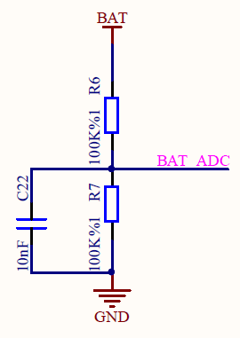

# Projects with the TTGO T-Display

Installation and power measurements are found at the bottom of this document.

## MicroPython

Some example programs:

- Mandelbrot
- green terminal
- prime numbers

## Arduino C

Examples here are:

- [Starfield simulation](https://github.com/kreier/t-display/tree/main/arduino/TFT_Starfield)
- Analog readings
- 

## Installation of Arduino

You need the following 5 steps to be able to program your T-Display with your Laptop/PC.

## Installation of MicroPython

Follow these 4 steps for MicroPython

## Power consumption

As [measured in April 2020](https://github.com/kreier/solarmeter/blob/master/README.md#power-consumption-t-display) the board needs 68 mA for running. With a battery of 1000 mAh you can use it for 9 hours.

Further measurement has been conducted in November 2020. The results.

You can directly measure the voltage of the LiPo battery on Pin 34. This can be seen in the [provided schematics from TTGO for the T-Display](TTGO_T-Display_schematics.pdf):

The pins are

