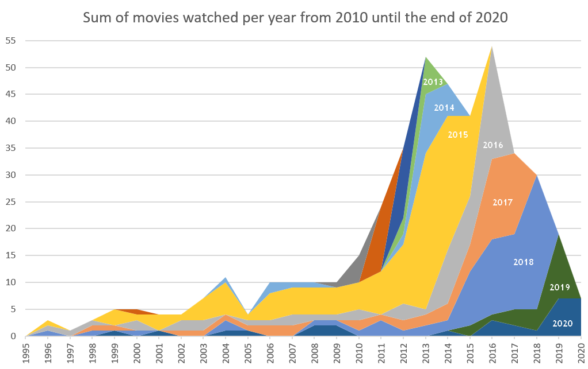

# Documentation of movie consumption

Most of us watch a lot of movies. Concepts and key lines are used for cultural reference. Many of my friends refer to movies quite often, so I decided to review my [on consumption](https://hofkoh.de/2014/10/filmliste/). Starting in 2013 I recorded every movie I watched. Published [October 2014](https://hofkoh.de/2015/06/medienkonsum-die-zweite/). For some movies I could remember to have seen them in the cinema. This is a graph of recent movies according to their release year and the year I watched them:

Since I took a mark if I watched a movie, the database goes back to 1921 with more than 4500 movies. As of now I watched 1335 of them. But rarely a new movie from long ago makes it to the list. Or if it does, I've already seen it and it doesn't show up. We're just watching the classics ...

## Purpose of this repository

As with many data collections it started out as an excel worksheet. Over time the demand on the data extends the capabilties of a spreadsheet document. I want to convert it to a .csv data file and then start to analyse and extend in python on kaggle or colaboratory with a jupyter notebook. Goals:

- Find the associated IMDB number for this movie for future reference.
- Add a recent number of global revenue from boxofficemojo.
- Indicate the original language of the movie.

The last point came to my attention only in 2019 and 2020 when rather unknown movies made it into the top100 grossing movies of that year. Turns out that the movie market in China has grown in the years since I started this project in 2013 that their domestic market was strong enough to compete with Hollywood.

BTW: I included some german movies that were not really recognized somewhere else in the world.

## Progress in 8 years

Since I started this project in 2013 I collected a lot of data on my movie culture. See how it evolved over a period of 8 years:

