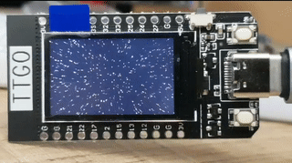
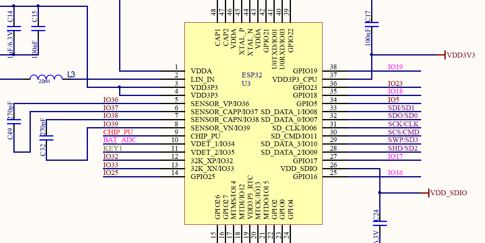
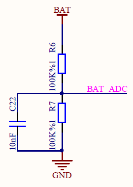
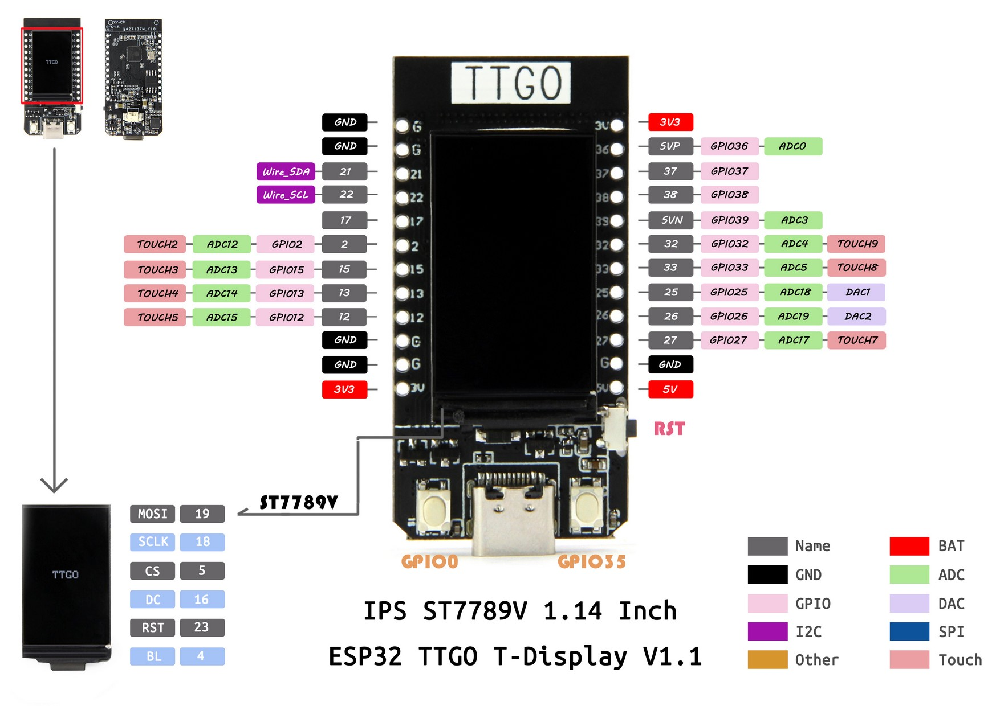

# Projects with the TTGO T-Display

Installation and power measurements are found at the bottom of this document.

## MicroPython

Some example programs:

- Mandelbrot
- green terminal
- prime numbers

## Arduino C

Examples here are:

- [Starfield simulation](https://github.com/kreier/t-display/tree/main/arduino/TFT_Starfield)
- [Mandelbrot calculation](https://github.com/kreier/t-display/tree/main/arduino/TFT_Mandlebrot)
- [Matrix simulation](https://github.com/kreier/t-display/tree/main/arduino/TFT_Matrix)
- [Analog readings](https://github.com/kreier/t-display/tree/main/arduino/TFT_Voltage)



## Installation of Arduino

You need the following 5 steps to be able to program your T-Display with your Laptop/PC.

## Installation of MicroPython

Follow these 4 steps for MicroPython:

- Download the latest python firmware for the ESP32 from [micropython.org](https://micropython.org/download/esp32/)
- Check your board with ```esptool.exe --port COM6 flash_id```
- Erase the flash ```esptool --port COM6 erase_flash```
- Flash the new firmware with ```esptool --port COM6 --baud 115200 ```
- Flash the new firmware with ```esptool --chip esp32 --port COM6 --baud 460800 write_flash -z 0x1000 esp32-20200902-v1.13.bin```

The esptool.exe is most likely located in your local folder C:\Users\You\AppData\Local\Arduino15\packages\esp32\tools\esptool_py\2.6.1\. To upload and download your python programs to your ESP32 you need thonny. For the editor you have some options:

- [Thonny]() 17 MByte
- [Mu Editor](https://codewith.mu/en/download) 65 MByte

If you have already Arduino IDE you can directly connect to the REPL interface:

``` py
>>> print("Hello world!")
Hello world.
```

## Power consumption

As [measured in April 2020](https://github.com/kreier/solarmeter/blob/master/README.md#power-consumption-t-display) the board needs 68 mA for running. With a battery of 1000 mAh you can use it for 9 hours.

Further measurement has been conducted in November 2020. The results.

You can directly measure the voltage of the LiPo battery on Pin 34. This can be seen in the [provided schematics from TTGO for the T-Display](TTGO_T-Display_schematics.pdf):




The pins are


