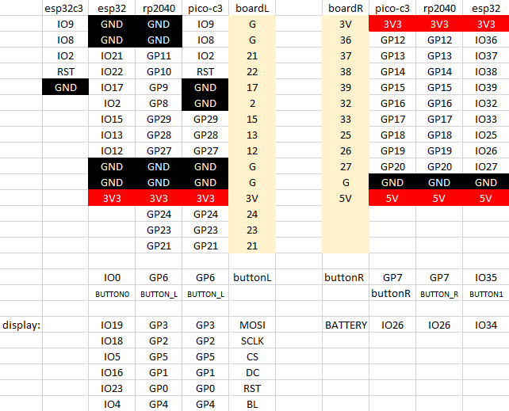
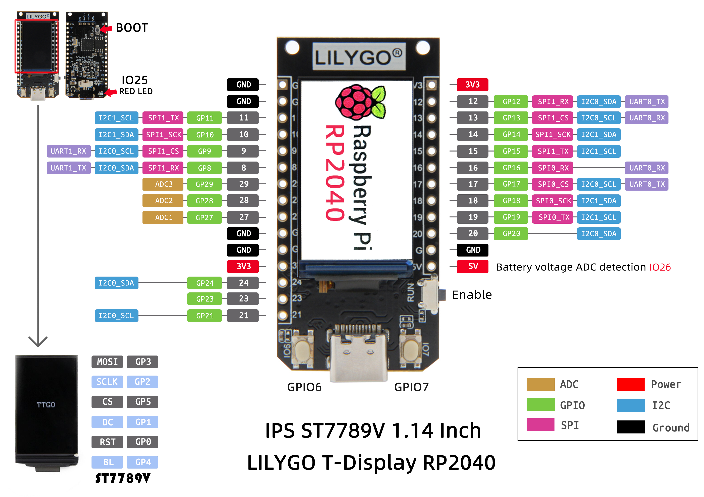
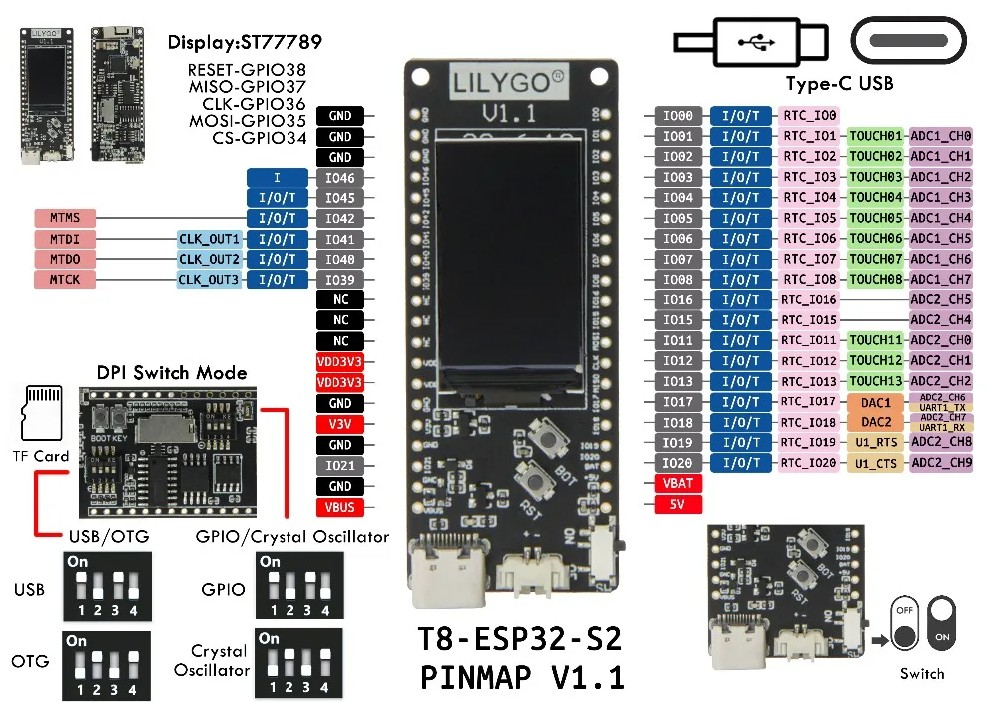

# Comparison for the 3 editions: ESP32, rp2040 and T-PicoC3

Here are the individual boards:

## T-Display ESP32

## T-Display rp2040

## T-PicoC3

## T8 ESP32-S2 ST7789

__March 2023__

# Circuitpython on T-Display rp2040 and T-PicoC3

Both boards are similar to the T-Display from 2019, but have a rp2040 MCU and in case of the C3 and additional esp32c3 for wifi connectivity.

To support them we need a VID and PID combination, see https://github.com/adafruit/circuitpython/pull/6037

Since the MCU is a rp2040 the VID could be `USB_VID = 0x2E8A` (that's the Raspberry Pi foundation) and we need to request a PID according to 

https://github.com/raspberrypi/usb-pid

It was requested already according to [https://github.com/adafruit/circuitpython/pull/6037](https://github.com/Xinyuan-LilyGO/LILYGO-T-display-RP2040/issues/5) from May 25, 2022:

Some history:

- https://github.com/adafruit/circuitpython/issues/6024 Feb 2022 - closed
- https://github.com/adafruit/circuitpython/pull/6037 Feb 2022 - still open, April 1st @fabaff that raspberry want OEM to make request
- https://github.com/Xinyuan-LilyGO/LILYGO-T-display-RP2040/issues/5 March 2022
- https://github.com/Xinyuan-LilyGO/LILYGO-T-display-RP2040/issues/13 Dec 2022

Timeline:
- Feb 15th, 2022 @erongd got it working, see issue #6024 on circuitpython
- Mar 19th, 2022 both @erongd and @fabaff submitted a PID request to raspberrypi (VID 2E8A)
- April 1st, 2022 pull 6037: @fabaff got response that raspberry pi wants OEM to make PID request
- November 16th, 2022 pull 6037 @tannewt suggests the use of pid.codes to solve the problem
- March 9th, 2022 PID pull request created for pid.codes https://github.com/pidcodes/pidcodes.github.com/pull/827

## Post on the forum

- https://community.lilygo.cc/topic/50/help-with-usb-vid-pid-for-circuitpython February 2022
- https://community.lilygo.cc/topic/145/t-display-rp2040-needs-usb-vid-pid?_=1678274382618 December 2022

## Write to info@raspberrypi.com

What is the current state? Fill out the form from https://github.com/raspberrypi/usb-pid 

